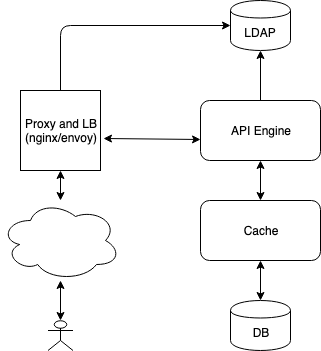
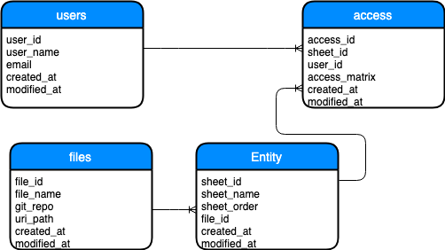
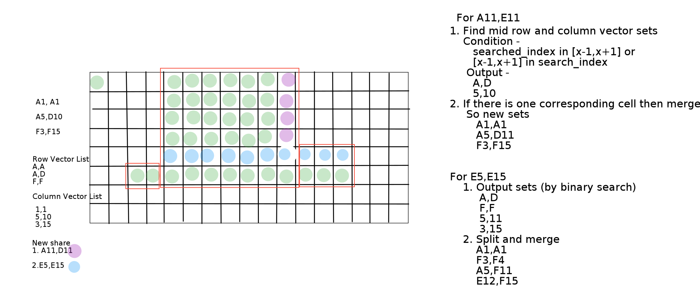

# API Engine

## Introduction

This is a backend **API** application that receives, stores and list **sharings**. Those sharings consists of **recipient emails** and **selections**. This **APIs** can be used by frontend.

## Architecture

API engine will provide two major APIs - `\list` and `\add`. Assuming read path will have major traffic then write path i.e. `\list` will have major traffic then `\add`. We proposed to have distributed write-through cache before persistant storage to handle high read load. Traffic to API Engine will be served via edge-proxy which in turn will authorize incoming requests via directory server. API Engine also will validate user via directory server. API Engine will get authentication information in request header. Here is proposed architecture -



## DB Schema

Following DB schema is being using -



Here `access.access_matrix` will store user's list of cell level access for perticular sheet in JSON format (In future we can store only binary data to save space) as sparse matrix. If cell acess is given for a range of consecutive cells then it will store only two diagonal cells id. But for single cell it will keep only one cell id. So this way in worst case it will store half of the cell ids in DB if every alternate cells are given access.

`files.git_repo` and `files.uri_path` will be used as referance to physical storage of files. So idea is to store each sheet in TSV format. Any modification to it and it's permission can be recorded as git history. And if your request that sheet then API Engine easily apply mask according to `access.access_matrix` and send it to frontend.

## Cells Access Add and Merge Algorithm

Our main reason to store only sparse matrix into persistant storage is to save space. But we will store pre-computed objects into cache to speed up the processing. Upone receiving `/add` request, API Engine will first fetch exiting objects from the cache, if not find then it will fetch, convert and store `two sorted vector lists` from DB, one for each row and columm. Then it will perform `binary search` into these two lists for access cell/cell_range to be added. By search it will find set of all the matching cell ranges. Among these two sets, it will find `intersection set`. Now it will find most suitable cell ranges to merge from `intersection set`. In the end it will try to condense final data by `merging and splitting` of cell ranges. After that it will store resultant data into persistant storage along with refreshing the cache. Following diagram explanin this algorithm - 




## API

`\add` API (`201` if successful, `404` for validation error and `5xx` if some issue with API Engine) -
```
curl -X POST \
  http://<url>/api/access/add \
  -H 'Accept: application/json' \
  -H 'Content-Type: application/json' \
  -H 'cache-control: no-cache' \
  -d '{
	"file_name": "file1",
	"emails": [
		"user1@email.com",
		"user2@email.com"
	],
	"selections": [{
			"sheet_name": "HRReport",
			"cell_range": null
		},
		{
			"sheet_name": "Assumptions",
			"cell_range": {
				"start": "ABC123",
				"end": null
			}
		},
		{
			"sheet_name": "Dashboard",
			"cell_range": {
				"start": "A2",
				"end": "BB2"
			}
		}
	]
}'
```

`\list` API (response is almost identical to `/add` request) -
```
curl -X GET \
  http://127.0.0.1:9090/api/access/list \
  -H 'Accept: application/json' \
  -H 'cache-control: no-cache'
```

For more information refer swagger UI (`/swagger-ui.html`).


## Implementation

I have developed API Engine in `Spring Boot Java` framework. And used many `Spring` provided SDKs to DB, Cache, LDAP server, validation, http server etc. 


## How to Run

First install `maven`, `JDK` and `Docker Engine`. Then
 modify application configuration file (`demo//src/main/resources/application.properties`) according to need. Also modify Docker Compose file (`stack.yml`) as per need. Also if you want to load some default data in DB then modify DB init file (`demo//src/main/resources/db/migration/V1__add_tables.sql`) as well. Inorder to deploy stack execute - 
 ```
 docker stack deploy <name of the stack>
 ```
